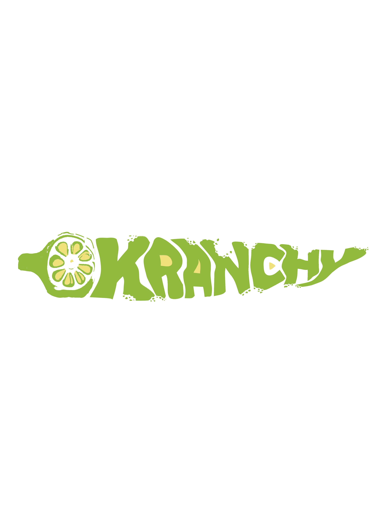

<div align="center">

  <picture>
    <source media="(prefers-color-scheme: dark)" srcset="assets/img/logo-3.png">
    
  </picture>

  # Okranchy 🥒✨

  **Crunchy Okra Chips — A Healthier Snack, Made in Valenzuela**

  [](https://github.com/ITSyndicate25/okranchy/commits/master)
  [](https://github.com/ITSyndicate25/okranchy)
  [](https://github.com/ITSyndicate25/okranchy)

  *An e-commerce feasibility study by **Ani Co.** — Pamantasan ng Lungsod ng Valenzuela*

</div>

---

## 🌿 Overview

Okranchy is a static e-commerce website for a line of crunchy, oven-baked okra chips. Born from a college feasibility study, the project simulates a real online storefront — complete with product browsing, cart management, checkout flow, customer testimonials, and user authentication pages.

The site is intentionally **framework-free**, built with vanilla HTML, CSS (with SCSS source files), and ES6+ JavaScript to demonstrate foundational web development skills.

---

## 🛒 Flavors

| Flavor | Sizes | Description |
|--------|-------|-------------|
| **Original — Salt & Vinegar** | 50g / 100g / 150g | Classic salted vinegar okra crunch |
| **Sour and Cream Onion** | 50g / 100g / 150g | Tangy sour cream okra crunch |
| **Spicy Barbeque** | 50g / 100g | Fiery chili bbq-seasoned okra crunch |
| **Sweet Barbeque** | 50g / 100g / 150g | Sweet and savory okra delight |
| **Premium Cheese** | 50g / 100g / 150g | Cheesy, savory okra delight |
| **Garlic Parmesan Cheese** | 50g / 100g / 150g | Cheesy goodness for everyone |
| **Salted Egg** | 50g / 100g / 150g | Crispy salted okra delight |
| **Spicy Salted Egg** | 50g / 100g / 150g | Crispy spicy salted okra delight |

---

## 📄 Pages

| Page | Description |
|------|-------------|
| [`index.html`](index.html) | Homepage — hero banner, flavor tabs with tropical redesign, discount countdown, specialty section, gallery, testimonials |
| [`about.html`](about.html) | Brand story, mission, team intro with signature |
| [`shop.html`](shop.html) | Full product grid with all flavors and sizes |
| [`shop-details.html`](shop-details.html) | Individual product view with description, reviews, related items |
| [`cart.html`](cart.html) | Shopping cart with quantity controls and totals |
| [`checkout.html`](checkout.html) | Checkout form with delivery and payment fields |
| [`gallery.html`](gallery.html) | Photo gallery showcasing products and branding |
| [`testimonials.html`](testimonials.html) | Customer reviews and ratings |
| [`faq.html`](faq.html) | Frequently asked questions accordion |
| [`contact.html`](contact.html) | Contact form, map, and store information |
| [`login.html`](login.html) | Sign-in form with client-side validation |
| [`register.html`](register.html) | Registration form with field validation |

---

## 🧱 Tech Stack

```
├── HTML5          → Semantic markup, BEM-like class naming (ul-* prefix)
├── CSS3 / SCSS    → Custom properties, clamp() fluid sizing, clip-path shapes
├── JavaScript ES6 → Vanilla DOM manipulation, event delegation, form validation
├── Bootstrap 5    → Grid layout, responsive utilities
├── Swiper.js      → Testimonials carousel, hero sliders
├── Splide.js      → Title ticker, product gallery
├── SlimSelect     → Custom dropdown styling
├── Flatpickr      → Date picker (booking/checkout)
├── Animate.css    → Scroll-triggered entrance animations
└── Flaticon       → Icon font set
```

---

## 🎨 Design System

```css
--ul-primary:   #33aa29    /* Okra green */
--ul-secondary: #FAA019    /* Warm orange accent */
--ul-black:     #010F1C    /* Rich dark */
--ul-gray:      #5C6574    /* Body text */
--ul-gradient:  linear-gradient(90deg, var(--ul-primary), var(--ul-secondary))
```

The homepage menu section features a **tropical/organic redesign** with:
- **Playfair Display** (serif) for product names and headings
- **DM Sans** for body text and navigation
- Warm cream background (`#f7f3ee`) with subtle leaf gradient overlays
- Flavor tabs with colored indicator dots
- Vertical product cards with hover lift and image scale animations

---

## 🚀 Getting Started

Since this is a static site, no build step is required:

```bash
# Clone the repo
git clone https://github.com/ITSyndicate25/okranchy.git

# Serve locally (any static server)
npx serve okranchy

# Or just open index.html in your browser
```

### SCSS Compilation (optional)

If editing `.scss` source files:

```bash
sass assets/scss/style.scss assets/css/style.css
```

---

## 📁 Project Structure

```
okranchy/
├── index.html               # Homepage
├── about.html               # About Us
├── shop.html                # Product listing
├── shop-details.html        # Product detail
├── cart.html                # Shopping cart
├── checkout.html            # Checkout flow
├── login.html               # Sign in
├── register.html            # Sign up
├── gallery.html             # Photo gallery
├── testimonials.html        # Customer reviews
├── faq.html                 # FAQ accordion
├── contact.html             # Contact & map
├── AGENTS.md                # Dev guidelines
├── assets/
│   ├── css/
│   │   └── style.css        # Compiled stylesheet
│   ├── scss/                # Source SCSS partials
│   │   ├── sections/        # Section-specific styles
│   │   └── pages/           # Page-specific styles
│   ├── js/                  # Vanilla JS
│   │   ├── main.js          # Core interactions
│   │   ├── tab.js           # Tab switching
│   │   ├── countdown.js     # Countdown timer
│   │   └── ...
│   ├── img/                 # Images & graphics
│   ├── icon/                # Flaticon font
│   └── vendor/              # Third-party libs
└── README.md
```

---

## 🌐 Social

- [Facebook](https://www.facebook.com/Okranchy)
- [Instagram](https://www.instagram.com/Okranchy)
- [TikTok](https://www.tiktok.com/@Okranchy)
- [LinkedIn](https://www.linkedin.com/company/okranchy)

---

<div align="center">
  <sub>
    Made for Ema By Kim &middot;
    Pamantasan ng Lungsod ng Valenzuela &middot;
    Ani Co. Feasibility Study
  </sub>
  <br>
  <sub>Okra is love. Okra is life. 🥒</sub>
</div>
